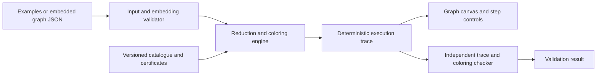

# Demo application implementation plan

Build a local, interactive **Four-Color Reduction Lab** that explains and executes the paper's reduction-and-restoration idea. Start with a bounded demonstrator on validated planar embeddings and a certified subset of configurations. Extend it into the complete algorithm only after the proof and certificate gaps in the [verification report](verification-report.md) are resolved.

The companion [implementation backlog](implementation-backlog.md) turns this design into ordered work packages P0-P10, concrete data contracts, a first-build walkthrough, and pass/fail release gates. Begin with P0-P4 and the shared-ring octahedron before expanding to the catalogue.

The first release should let a user load an example, inspect charges, watch several separated configurations disappear, inspect the smaller graph, and step through Kempe swaps and restoration. It should also explain the short-cycle branch. Every displayed final coloring must pass a separate edge-by-edge validator.

## Product scope and completion criteria

There are two distinct milestones:

| Milestone | What it demonstrates | What can be claimed |
|---|---|---|
| Educational demo | Genuine catalogue matching, supported batch reductions, exact small-instance coloring, Kempe recoloring, trace replay, and selected separator examples | Executes specified parts of the proposal on supported examples; reports where a bounded solver is used |
| Research implementation | Entire catalogue, local unavoidability search, both reduction branches, full restoration certificates, corrected accounting, and performance instrumentation | Implements the paper's algorithm after documented corrections; an O(n log n) claim requires an audited cost argument |

Do not silently substitute a general backtracking solver when a paper step fails. The educational release may offer an explicitly labeled **“Solve this small graph by search”** action, with a vertex/time limit and an `unknown/limit reached` result. A completed coloring has a directly checkable correctness certificate regardless of how it was found; that does not certify the algorithm's runtime or the theorem.

Initial limits are engineering hypotheses: editable examples of roughly 10-200 vertices, small configuration rings, and a cancellable computation budget. Measure these before promising a maximum. Larger imported graphs can be read-only or disabled until profiling establishes usable limits.

## User experience

The screen has a graph canvas, a short explanation panel, and a step timeline. Offer these examples:

- **Octahedron:** opposite degree-4 configurations share a ring. This is both a simple restoration lesson and the regression example for the paper's disjoint-ring error.
- **Flat triangular patch:** place `D2834.conf` in a generated sphere triangulation to demonstrate why positive charge alone is insufficient. Verify its required degrees after closing the patch; do not treat an open lattice patch as the theorem's input.
- **Small catalogue configuration:** use `D0000.conf` with a suitable exterior and its certified restoration data.
- **Separating triangle and 4-cycle:** show independent subproblem coloring and boundary reconciliation.
- **Obstructing 5-cycle:** show the requirement of two vertices on each side and the choice among the three gadget families.
- **High-degree public vertex:** explain why degree-bounded neighborhoods and shared public parts matter.

Provide play, pause, next, previous, reset, and speed controls. Show colors both as hues and numbers/patterns. The explanation should say what the selected step achieves, such as “These regions can be removed together” or “Swapping this connected two-color region keeps every edge valid.” Mathematical definitions and paper references belong in an optional detail drawer.

Useful overlays are original versus auxiliary edges, degree, initial/final charge, selected configuration vertices, ring positions, and the current Kempe components. A ring position must remain visible even if it refers to a vertex used by another ring. Counts should distinguish vertices, ring positions, and unique ring vertices.

The final screen shows the coloring, number of colors used, validation result, and a downloadable JSON trace. The trace records which steps use the proposal and whether a bounded search was used. Playback is driven by actual execution events, not prewritten animations presented as computation.

## Architecture

Use a small TypeScript browser interface with Canvas for larger graphs and SVG overlays for selections and labels. Keep all mathematical state in an independent engine. Start with a native C++ command-line engine that writes JSON traces; the UI can load these files without a service. Add a local worker/service for interactive runs once the engine is stable. Evaluate a WebAssembly build later, after checking the inherited Boost/filesystem dependencies and memory requirements.

The existing author repositories contain proof-checking tools and data, not a ready-to-use end-to-end coloring application. Treat their data readers and matching routines as reusable candidates subject to audit; Sections 12-13 still require implementation.



Proposed repository layout for future implementation:

```text
app/                  browser interface and playback
engine/               embedding, matching, reduction, restoration
certificates/         versioned ring ranks and extension witnesses
examples/             embedded graph fixtures and expected behavior
schemas/              input, certificate, and trace schemas
tests/                independent validators and adversarial fixtures
benchmarks/           operation counts, timing, memory, and seeds
verification/         existing review evidence and Lean obligations
docs/                 proposal mapping, limitations, and developer notes
```

## Engine contracts

### Embedded graph

Use stable vertex and dart IDs, reverse darts, clockwise rotation order, face traversal, and provenance for every auxiliary edge/vertex. Keep an immutable original edge set for final validation. Store colors as integers 0-3 and `uncolored` separately.

For the educational release, accept supplied embeddings and validate connectedness, simplicity, symmetric adjacency, rotation consistency, triangular faces when required, and the sphere embedding. Euler characteristic alone is not a sufficient validator for arbitrary malformed input. Later add a planarity/embedding algorithm and triangulation for general simple planar graphs, with explicit handling of disconnected components and n≤3. Reject loops; normalize parallel edges only under a documented input contract.

### Configuration catalogue and certificates

Import the pinned 8,200 files and add explicit degree-3/4 singleton cases. Preserve the difference between internal vertices and free-completion ring positions. Match degree constraints, orientation, facial triangles, cut-vertex placement, and inducedness. Adjacency alone is insufficient.

For each supported configuration store:

- Original catalogue ID, source hash, free completion, and ordered ring positions.
- Canonical ring-color representation and reversible color-permutation mapping.
- Level 0 extension witnesses, and higher-level certificates checked against frozen lower levels.
- The completeness justification for the compatible exterior Kempe patterns.

A Boolean “D-reducible” result is not a restoration table. Do not infer ranks from the number of in-place update sweeps in the upstream checker. Enumerate tables offline or generate them on demand with strict memory/time limits, then cache with the configuration and checker hashes. Exhaustive enumeration on a ring of size 18 is a significant cost, not a UI operation.

### Discharging and candidate selection

Compute 10(6-degree) with signed integers. Apply all 84 oriented rules, respecting their precise degree ranges and facial embeddings. Verify that the total charge stays 120 on a sphere triangulation.

Represent degree-bounded balls and their high-degree boundary vertices separately. For an educational example, directly find and validate candidate configurations, then greedily select non-touching interiors. For the full algorithm, implement Theorem 6.7's local search and the explicit constant-factor packing argument, including the low-degree cases. Finding some convenient independent set of candidates does not establish the theorem's linear-density guarantee.

### Reduction and restoration

For each batch record a reversible operation journal. Remove the selected interiors, add valid auxiliary triangulation edges, recursively color, undo auxiliary topology, and restore the original vertices. Keep the ring-position-to-graph-vertex mapping, allowing repeated vertices and shared vertices across rings.

Build each pass's Kempe components on the currently colored graph. Construct **chain-to-ring incidence lists**, deduplicating each ring's occurrences of the same component. Total ring incidence is O(sum |R_i|); use this in the cost accounting. Never use a single host-ring field on a vertex.

For each ring, find a compatible improving swap prescription from its certified level data. Select a complementary color pairing, then decide swap/no-swap using exact conditional-expectation weights. Record each decision and its potential. Apply the pass, extend level-0 configurations, and rebuild components before the next pass. Configurations that fail to improve leave the current active group and can re-enter at the next block; do not assume every ring improves on every pass.

### Obstructing cycles

Detection must validate chordlessness, inside/outside vertex counts, non-crossing relations, and non-touching private parts. Store a hierarchy whose shared public edges are explicit.

Implement the four replacement possibilities for a 4-cycle and eleven for a 5-cycle, with boundary-color classes and inverse reconstruction records. For 5-cycles, include the exterior degree-5 vertex before recursive coloring when needed to force a three-color boundary. A five-cycle surrounding a single vertex is not obstructing under the paper's definition.

When identifying boundary vertices, remove duplicate edges safely and check that no unintended loop or chord is introduced. Implement the small-component threshold and the corrected `100b≤c` accounting before claiming constant-factor progress for this branch. Color-permutation reconciliation must act on the complete stored component coloring.

### Execution trace

Every event carries an event ID, graph-state version, and operation-specific witness. The schema should include:

`InputValidated`, `ChargeTransferred`, `CandidatesFound`, `BatchSelected`, `Reduced`, `RecursionEntered`, `KempeComponentsBuilt`, `SwapChosen`, `ConfigurationExtended`, `CycleReplaced`, `ComponentRestored`, `ColoringValidated`, and `LimitReached`.

Include source IDs, affected vertices/edges, color changes, boundary mappings, graph hashes, certificate hashes, and solver provenance where applicable. Use checkpoints plus reversible deltas so backward playback does not duplicate every graph at every step. Large traces may be streamed and sampled for display; verification retains every semantic operation.

## Milestones and acceptance gates

Estimates below are planning ranges for one engineer comfortable with graph algorithms. They exclude the open-ended research effort of fully formalizing the paper, and should be revised after the first prototype.

| Stage | Deliverable | Acceptance gate | Initial effort |
|---|---|---|---|
| 0 | Corrected specification, fixtures, schemas, pinned evidence | F1-F3 repairs documented; formal obligations listed; no claim of complete verification | 2-4 days |
| 1 | Embedded-graph engine, original-edge validator, trace player | Octahedron, tetrahedron, and tiny invalid inputs behave correctly; deterministic replay | 4-7 days |
| 2 | Small certified catalogue subset and restoration engine | Degree-3/4 cases and at least one supplied configuration restore correctly; shared-ring case passes | 1-2 weeks |
| 3 | Discharging, flat example, batch selection, conditional-expectation visualization | Actual charge conservation; supported batch reduces the graph; every swap and final coloring validates | 1-2 weeks |
| 4 | Selected 3/4/5-cycle examples and usable educational release | Boundary classes reconcile; unsupported cases and computation limits are explicit; export/replay passes | 1-2 weeks |
| 5 | Complete algorithm and catalogue integration | All offline certificates and both recursive branches pass; quantified progress and cost audit | Research milestone; estimate after Stage 4 |
| 6 | Full theorem/implementation formalization | All remaining proof obligations discharged in a trusted checker | Separate research project |

Stages 0-4 form a roughly **4-8 week educational demo**, subject to certificate-generation feasibility. Stage 2 is the main early decision point: if reliable small-subset rank generation is not yet available, release a narrower degree-3/4 and separator demonstrator with that scope stated, and continue the catalogue work separately.

## Verification strategy

Keep the final coloring validator separate from the engine: verify exactly one color in 0-3 for every original vertex and different colors on every original edge. This is O(n+m), and O(n) for simple planar inputs. A proper coloring certificate needs no appeal to the paper's proof.

For transformations, check preconditions and invariants at each event in debug runs: topology, coloring of all currently colored edges, preserved boundary identities, non-touching selected interiors, and complete restoration of the original graph. Check certificates independently of the search code that generated them.

The regression suite must cover:

- Empty and tiny graphs, disconnected inputs, K4, octahedron, invalid loops, K5, and K3,3 when the general planarity importer is added.
- Distinct configurations with identical rings; rings sharing one high-degree vertex; repeated positions of a ring; and multiple ring vertices on one Kempe chain.
- Cut-vertex configurations such as `D2861.conf`, where a path using only boundary edges need not follow the outer facial walk.
- A proper partial coloring with no level-0 extension that becomes extendible after a certified Kempe change.
- Non-improving rings that are postponed while other rings extend; component labels rebuilt after restoration.
- Nested cycles, a shared public edge, a 5-cycle with one vertex on a side, and gadget contractions that create parallel edges.
- Color-permutation invariance, mirrored embeddings, renumbered vertices, corrupted certificates, and deterministic seeded replay.

Use an independent exhaustive solver as an oracle only on small graphs, with its cost excluded from algorithm benchmarks. Bounded tests increase confidence; they do not establish unavoidability for all planar triangulations.

For benchmarks, collect engine time, peak memory, matched candidates, selected batch size, n_after/n_before, number of Kempe passes, total ring incidences scanned, separator counts, and vertices/edges processed at each recursion level. Separate offline preprocessing, rendering, tracing, and any baseline solver from the measured coloring work. Plot operation counts as well as time. Empirical curves alone do not prove O(n log n).

## First implementation slice

Begin with the octahedron example, the graph/trace schemas, the independent coloring validator, degree-4 restoration, and the corrected shared-ring incidence lists. This slice exercises a real paper reduction, produces a complete interactive explanation, and directly tests the most important implementation correction found in the review. Add `D0000` and then the flat configuration only after the certificate interface works.

The original review delivered verification code, source snapshots, reports, and this plan. Subsequent work added a public coloring exhibit and a limited browser benchmark. See [algorithm comparison and benchmark scope](algorithm-comparison.md) for their exact capabilities; neither complete historical algorithm is implemented, and these additions do not complete the research milestones above.
